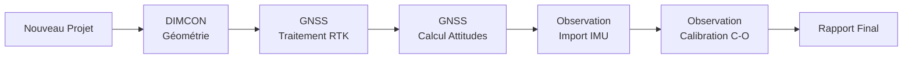

# 🚢 DynaCalibration GNSS

[](https://www.python.org/)
[](https://www.riverbankcomputing.com/software/pyqt/)
[]()

> Application de calibration dynamique GNSS multi-antennes pour navires avec traitement RTK haute précision et fusion de capteurs inertiels (IMU/MRU).

---

## 📋 Table des matières

- [Vue d'ensemble](#-vue-densemble)
- [Fonctionnalités principales](#-fonctionnalités-principales)
- [Architecture](#-architecture)
- [Installation](#-installation)
- [Guide de démarrage rapide](#-guide-de-démarrage-rapide)
- [Workflow complet](#-workflow-complet)
- [Structure du projet](#-structure-du-projet)
- [Documentation technique](#-documentation-technique)
- [Dépendances](#-dépendances)
- [Foire aux questions](#-foire-aux-questions)
- [Contribution](#-contribution)
- [Licence](#-licence)

---

## 🎯 Vue d'ensemble

**DynaCalibration GNSS** est une solution logicielle professionnelle conçue pour calibrer dynamiquement les capteurs inertiels (IMU, MRU, Gyrocompas) des navires en utilisant les positions GNSS multi-antennes comme référence absolue. 

### 🌟 Cas d'usage

- Calibration des capteurs d'attitude (Heading, Pitch, Roll) sur navires océanographiques, de pose de câbles, ou plateformes offshore
- Traitement post-mission des données GNSS avec corrections SP3 haute précision (orbites IGS)
- Analyse de cohérence entre attitudes GNSS et capteurs inertiels (Octans, MRU, etc.)
- Génération de rapports de contrôle qualité pour audits et certifications

### 🎓 Principe de fonctionnement

L'application utilise **3 antennes GNSS** positionnées sur le navire (typiquement Bow, Port, Starboard) pour :
1. Calculer les **vecteurs de baseline** entre antennes via traitement RTK (RTKLIB)
2. Déduire l'**attitude absolue** du navire (heading, pitch, roll) par géométrie 3D
3. Comparer ces attitudes de référence avec les mesures des capteurs inertiels embarqués
4. Calculer les **biais de calibration** (misalignment C-O, dérive temporelle)

---

## ✨ Fonctionnalités principales

### 🗂️ Gestion de projet avancée
- Création et sauvegarde de projets structurés (JSON + répertoires)
- Métadonnées complètes : nom du navire, compagnie, ingénieur responsable
- Système de versioning et backup automatique
- Auto-sauvegarde à chaque étape de validation

### 📐 Module DIMCON - Géométrie du navire
- Interface graphique 3D interactive pour visualisation du navire
- Saisie des positions des antennes GNSS (X, Y, Z en repère bateau)
- Validation et export des coordonnées vers le projet
- Support de configurations multi-antennes (3+)

### 🛰️ Module GNSS - Traitement RTK & Calculs d'attitude

#### Onglet 1 : Traitement RTK
- Import de fichiers RINEX (.obs, .nav)
- Téléchargement automatique des fichiers SP3/CLK (orbites/horloges précises IGS)
- Traitement RTK avec RTKLIB intégré (calcul des positions précises)
- Monitoring en temps réel de la progression par baseline
- Export automatique des fichiers .pos

#### Onglet 2 : Finalisation & Analyse
- Calcul automatique des attitudes (heading, pitch, roll) depuis les baselines
- Filtrage qualité (Q=1 Fix, Q=2 Float)
- Visualisations interactives (graphiques matplotlib)
- Statistiques détaillées (min, max, moyenne, écart-type)
- Export des attitudes dans ApplicationData pour étapes suivantes

### 📊 Module Observation - Calibration IMU

#### Onglet 1 : Import capteurs
- Support de multiples types de capteurs : Octans, MRU, Gyrocompas
- Import CSV avec détection automatique du format
- Gestion de gros volumes (>800k points) avec indicateur de progression
- Prévisualisation des données importées
- Validation et stockage dans le projet

#### Onglet 2 : Calibration C-O (Computed-Observed)
- Synchronisation temporelle GNSS ↔ IMU (interpolation)
- Calcul des écarts angulaires (biais de misalignment)
- Analyse statistique complète avec histogrammes
- Détection de dérive temporelle (tendances)
- Export des résultats de calibration (CSV, JSON, rapport HTML)

### 🔍 Module QC - Contrôle Qualité
- Tableaux de bord de suivi du workflow
- Scores de qualité par module (DIMCON, GNSS, Observation)
- Validation automatique selon critères métier
- Génération de rapports de calibration (HTML/PDF)

### 🎨 Interface utilisateur moderne
- Design sombre professionnel (thème Nord)
- Menu vertical avec indicateurs de progression par module
- Console de logs intégrée avec export
- Navigation fluide entre modules
- Raccourcis clavier (Ctrl+N, Ctrl+O, Ctrl+S)

---

## 🏗️ Architecture

### Stack technologique

- **Interface graphique** : PyQt5 (architecture Model-View)
- **Calcul scientifique** : NumPy, Pandas, SciPy
- **Visualisation** : Matplotlib (backend Qt5Agg interactif)
- **Traitement GNSS** : RTKLIB (binaire externe rnx2rtkp.exe)
- **Données** : HDF5 (via h5py) pour gros volumes, JSON pour configuration
- **Validation** : jsonschema pour intégrité des projets

### Composants principaux

```
DynaCalibration_GNSS/
├── src/
│   ├── app/                    # Interface utilisateur (PyQt5)
│   │   ├── main.py            # Fenêtre principale
│   │   └── gui/               # Widgets des pages
│   │       ├── page_accueil.py
│   │       ├── page_Dimcon.py
│   │       ├── page_GNSS.py
│   │       ├── page_observation.py
│   │       └── ...
│   ├── core/                   # Logique métier
│   │   ├── app_data.py        # Modèle de données centralisé (signaux Qt)
│   │   ├── project_manager.py # Gestion du cycle de vie des projets
│   │   ├── progress_manager.py # Suivi de progression des modules
│   │   ├── calculations/      # Algorithmes de calcul
│   │   │   ├── rtk_calculator.py
│   │   │   ├── calibration.py
│   │   │   └── ...
│   │   ├── importers/         # Parseurs de fichiers
│   │   │   ├── rinex_parser.py
│   │   │   ├── import_gnss.py
│   │   │   └── import_observation.py
│   │   └── reports/           # Génération de rapports
│   └── utils/                  # Utilitaires
├── RTKlib/                     # Binaire RTKLIB + configs
├── data/                       # Données de test
├── docs/                       # Documentation technique
├── tests/                      # Tests unitaires et d'intégration
├── projets/                    # Projets utilisateur (créés automatiquement)
├── config.json                 # Configuration globale
└── requirements.txt            # Dépendances Python
```

### Modèle de données

L'application utilise une architecture **reactive** basée sur les signaux Qt :

- **ApplicationData** : Store centralisé avec émission de signaux `data_changed(section)`
- **ProjectManager** : Singleton pour gestion du projet courant (signaux `project_loaded`, `project_saved`)
- **ProgressManager** : Suivi de la progression (signaux `progress_updated`, `module_completed`)

Toutes les pages écoutent ces signaux pour se mettre à jour automatiquement.

---

## 📦 Installation

### Prérequis

- **Python 3.8+** (testé avec Python 3.9, 3.10, 3.11)
- **Windows 10/11** (ou Linux/macOS avec adaptations)
- **Git** (pour cloner le dépôt)
- **~500 MB d'espace disque** (application + données de test)

### Installation via Git

```bash
# Cloner le dépôt
git clone https://github.com/votre-organisation/DynaCalibration_GNSS.git
cd DynaCalibration_GNSS

# Créer un environnement virtuel (recommandé)
python -m venv venv

# Activer l'environnement
# Windows
venv\Scripts\activate
# Linux/macOS
source venv/bin/activate

# Installer les dépendances
pip install -r requirements.txt
```

### Installation manuelle

Si vous avez reçu l'application sous forme d'archive ZIP :

```bash
# Extraire l'archive
# Naviguer vers le dossier
cd DynaCalibration_GNSS

# Créer l'environnement virtuel
python -m venv venv
venv\Scripts\activate

# Installer les dépendances
pip install -r requirements.txt
```

### Vérification de l'installation

```bash
# Lancer l'application
python src/app/main.py
```

Si tout fonctionne, la fenêtre principale devrait s'ouvrir avec le message "Prêt - Créez ou ouvrez un projet".

---

## 🚀 Guide de démarrage rapide

### 1. Créer un nouveau projet

1. Lancez l'application : `python src/app/main.py`
2. Sur la **Page d'accueil**, cliquez sur **"🆕 Nouveau Projet"**
3. Remplissez les informations :
   - **Nom du navire** : ex. "THIALF"
   - **Nom de la compagnie** : ex. "Heerema Marine Contractors"
   - **Ingénieur responsable** : votre nom
4. Cliquez sur **"Créer le projet"**
5. Le projet est créé dans `projets/NomNavire_NomProjet/`

### 2. Configurer la géométrie (DIMCON)

1. Naviguez vers **Module DIMCON** (menu vertical)
2. Entrez les coordonnées des 3 antennes GNSS en **repère bateau** (X, Y, Z en mètres) :
   - **Bow** (avant)
   - **Port** (bâbord)
   - **Stbd** (tribord)
3. Cliquez sur **"Valider DIMCON"**
4. Les données sont sauvegardées automatiquement dans le projet

**Exemple de coordonnées (navire THIALF)** :
```
Bow:  [-0.269, -64.232, 10.888]
Port: [-9.347, -27.956, 13.491]
Stbd: [9.392, -27.827, 13.506]
```

### 3. Traiter les données GNSS

#### Étape 3a : Traitement RTK

1. Naviguez vers **Module GNSS** → Onglet **"📡 Traitement RTK"**
2. Cliquez sur **"Charger fichiers RINEX"**
3. Sélectionnez les fichiers :
   - 3 fichiers `.obs` (un par antenne : Bow, Port, Stbd)
   - 3 fichiers `.nav` (données de navigation)
   - 1 fichier `.sp3` (optionnel mais recommandé : orbites précises)
   - 1 fichier `.clk` (optionnel : corrections d'horloge)
4. Cliquez sur **"🚀 Démarrer le Traitement RTK"**
5. Attendez la fin du traitement (barres de progression dans le menu vertical)
6. Les fichiers `.pos` sont générés dans `projets/VotreProjet/data/processed/gnss/`

#### Étape 3b : Calcul des attitudes

1. Restez dans **Module GNSS** → Basculez vers l'onglet **"🔧 Finalisation des calculs GNSS"**
2. Cliquez sur **"🚀 Démarrer l'analyse"**
3. Le calcul s'effectue (quelques secondes pour ~20k points)
4. Visualisez les résultats :
   - Graphiques interactifs des attitudes au cours du temps
   - Statistiques détaillées (min, max, moyenne, écart-type)
5. Les attitudes GNSS sont stockées automatiquement dans ApplicationData

**Exemple de résultats attendus** :
```
📊 HEADING: Min: 108.33° | Max: 109.00° | Moyenne: 108.64°
📊 PITCH:   Min: -0.32° | Max: 2.04°  | Moyenne: 0.95°
📊 ROLL:    Min: -0.23° | Max: 1.92°  | Moyenne: 0.55°
✅ 19193 points d'attitude calculés
```

### 4. Importer les données IMU

1. Naviguez vers **Module Observation** → Onglet **"📥 Import Capteurs"**
2. Configurez le nombre de fichiers par capteur :
   - **Octans : 2 fichiers** (1 heading + 1 pitch/roll)
   - **MRU : 3 fichiers** (heading, pitch, roll séparés)
3. Cliquez sur **"Importer"** pour le capteur souhaité
4. Sélectionnez les fichiers CSV correspondants
5. Attendez la fin de l'import (peut prendre ~30s pour 800k points)
6. Vérifiez le statut : "Importé (XXXXXX pts)"

### 5. Effectuer la calibration C-O

1. Restez dans **Module Observation** → Basculez vers l'onglet **"🎯 Calibration C-O"**
2. Vérifiez le statut des données :
   ```
   Référence GNSS: ✅ XXXXX points d'attitude calculés
   Capteurs IMU:   ✅ XXXXXX observations IMU
   ```
3. Cliquez sur **"🚀 Lancer la calibration complète"**
4. Attendez le traitement (synchronisation temporelle + calcul des biais)
5. Visualisez les résultats :
   - Graphiques de comparaison GNSS vs IMU
   - Histogrammes des écarts
   - Statistiques de biais (heading, pitch, roll)
6. Cliquez sur **"📊 Générer le rapport de calibration"**

### 6. Exporter les résultats

- **Rapport HTML** : `projets/VotreProjet/reports/rapport_calibration_YYYYMMDD_HHMMSS.html`
- **Données CSV** : `projets/VotreProjet/data/processed/calibration/`
- **Logs** : `projets/VotreProjet/logs/`

---

## 📚 Workflow complet

### Vue d'ensemble du processus



### Étapes détaillées

| Étape | Module | Description | Durée estimée | Validation |
|-------|--------|-------------|---------------|------------|
| **1** | Accueil | Création du projet + métadonnées | 2 min | ✅ Projet créé |
| **2** | DIMCON | Saisie des positions des antennes GNSS | 5 min | ✅ 3 antennes validées |
| **3a** | GNSS (RTK) | Traitement RTK des fichiers RINEX | 10-30 min | ✅ Fichiers .pos générés |
| **3b** | GNSS (Finalisation) | Calcul des attitudes depuis les baselines | 10 sec | ✅ Attitudes stockées dans ApplicationData |
| **4** | Observation (Import) | Import des données des capteurs inertiels | 30 sec - 2 min | ✅ Données IMU importées |
| **5** | Observation (Calibration) | Synchronisation + calcul des biais C-O | 20 sec - 1 min | ✅ Biais calculés |
| **6** | Observation (Rapport) | Génération du rapport de calibration | 5 sec | ✅ Rapport HTML exporté |

### Indicateurs de progression

L'application affiche en temps réel la progression dans le **menu vertical** (barres de couleur pour chaque module) :

- 🟢 **Vert** : Module complété avec succès
- 🟡 **Jaune** : Module en cours de traitement
- ⚪ **Gris** : Module non démarré

---

## 📁 Structure du projet utilisateur

Lorsque vous créez un projet, l'arborescence suivante est générée automatiquement :

```
projets/NomNavire_NomProjet/
├── NomProjet.json              # Fichier principal du projet (métadonnées, config, état)
├── backups/                    # Sauvegardes automatiques (versioning)
│   ├── NomProjet_20250101_120000.json
│   └── ...
├── cache/                      # Fichiers temporaires (téléchargements SP3, etc.)
│   └── sp3_downloads/
├── data/                       # Données brutes et traitées
│   ├── raw/                    # Fichiers RINEX, CSV capteurs (originaux)
│   │   ├── gnss/
│   │   │   ├── bow.obs
│   │   │   ├── port.obs
│   │   │   ├── stbd.obs
│   │   │   ├── nav.nav
│   │   │   ├── precise.sp3
│   │   │   └── precise.clk
│   │   └── sensors/
│   │       ├── octans_heading.csv
│   │       └── octans_pitchroll.csv
│   └── processed/              # Résultats de traitement
│       ├── gnss/
│       │   ├── bow_port.pos
│       │   ├── bow_stbd.pos
│       │   ├── port_stbd.pos
│       │   └── attitudes_gnss.csv
│       └── calibration/
│           ├── biais_calibration.csv
│           └── comparaison_co.csv
├── logs/                       # Journaux d'exécution
│   ├── project_operations.log
│   ├── rtk_processing.log
│   └── calibration.log
└── reports/                    # Rapports générés
    ├── rapport_calibration_20250119_153000.html
    └── qc_dashboard_20250119_153000.html
```

### Description des fichiers clés

- **`NomProjet.json`** : Contient toutes les métadonnées du projet (navire, compagnie, dates, configuration DIMCON, état du workflow, chemins des fichiers, etc.)
- **`backups/`** : Copies automatiques du fichier .json à chaque sauvegarde (jusqu'à 10 versions)
- **`data/raw/gnss/`** : Fichiers RINEX importés (lecture seule)
- **`data/processed/gnss/*.pos`** : Sorties RTKLIB (positions précises par baseline)
- **`data/processed/calibration/`** : Résultats finaux de la calibration C-O
- **`reports/*.html`** : Rapports de calibration prêts à être partagés

---

## 📖 Documentation technique

### Documents disponibles

- **[Guide d'utilisation complet](GUIDE_UTILISATION_CALIBRATION.md)** : Manuel utilisateur détaillé avec captures d'écran
- **[Plan de route du projet](docs/plan_route_projet.md)** : Feuille de route des développements futurs
- **[Workflow de calibration](WORKFLOW_CALIBRATION_FINAL.md)** : Diagrammes et explications techniques
- **[Différences GNSS/Calcul](DIFFERENCES_GNSS_CALCUL.md)** : Analyse des sources d'erreur
- **[Guide développeur](docs/Guide de Développement GNSS _ Implémentation Complète d'un Système Multi-Antennes avec Python.pdf)** : Architecture et API internes
- **[Documentation NL-MAI-TCH](docs/NL-MAI-TCH-WI-037-Dynamic Calibration.pdf)** : Procédure de calibration dynamique (standard Heerema)

### Concepts clés

#### Baseline GNSS
Une **baseline** est le vecteur 3D entre deux antennes GNSS. Avec 3 antennes, on obtient 3 baselines :
- `Bow ↔ Port`
- `Bow ↔ Stbd`
- `Port ↔ Stbd`

Ces vecteurs permettent de reconstituer l'orientation du navire dans l'espace 3D.

#### Attitudes GNSS (Heading, Pitch, Roll)

À partir des baselines et des positions DIMCON des antennes, on calcule :

- **Heading (Cap)** : Angle azimutal du navire par rapport au Nord géographique (0-360°)
- **Pitch (Tangage)** : Angle de basculement longitudinal (nez haut/bas, -90 à +90°)
- **Roll (Roulis)** : Angle de basculement latéral (babord/tribord, -90 à +90°)

Ces valeurs servent de **référence absolue** pour calibrer les capteurs inertiels.

#### Calibration C-O (Computed-Observed)

La calibration C-O compare :
- **Computed (C)** : Attitudes calculées depuis les positions GNSS (référence absolue)
- **Observed (O)** : Attitudes mesurées par les capteurs inertiels (Octans, MRU)

Les **biais de misalignment** sont les différences systématiques entre C et O :

```
Biais_Heading = Heading_GNSS - Heading_IMU
Biais_Pitch   = Pitch_GNSS   - Pitch_IMU
Biais_Roll    = Roll_GNSS    - Roll_IMU
```

Ces biais permettent de corriger les mesures IMU pour les rendre cohérentes avec la référence GNSS.

#### Synchronisation temporelle

Les données GNSS et IMU n'ont pas forcément les mêmes timestamps. L'application effectue une **interpolation temporelle** pour synchroniser les séries :

1. Extraction des timestamps communs (intersection)
2. Interpolation linéaire des attitudes GNSS sur les timestamps IMU
3. Calcul des écarts point par point

---

## 🔧 Dépendances

### Dépendances Python (requirements.txt)

```txt
PyQt5>=5.15.0              # Interface graphique
numpy>=1.21.0              # Calcul matriciel
pandas>=1.3.0              # Manipulation de données tabulaires
h5py>=3.1.0                # Stockage HDF5 (gros volumes)
jsonschema>=4.0.0          # Validation de schémas JSON
matplotlib>=3.5.0          # Visualisations graphiques
scipy>=1.7.0               # Algorithmes scientifiques (interpolation, filtrage)
pathlib2>=2.3.0            # Manipulation de chemins (compatibilité)
python-dateutil>=2.8.2     # Parsing de dates
```

### Dépendances externes

- **RTKLIB** : Le binaire `rnx2rtkp.exe` est fourni dans le dossier `RTKlib/`. Il s'agit de la version compilée du moteur de traitement RTK open-source.
  - **Licence** : BSD 2-Clause
  - **Source** : https://github.com/tomojitakasu/RTKLIB
  - **Version** : 2.4.3 b34 (ou supérieure)

---

## ❓ Foire aux questions

### Installation & Configuration

**Q : L'application ne démarre pas, j'ai une erreur "ModuleNotFoundError: No module named 'PyQt5'"**

**R :** Vérifiez que vous avez bien activé l'environnement virtuel et installé les dépendances :
```bash
venv\Scripts\activate
pip install -r requirements.txt
```

---

**Q : Où sont stockés mes projets ?**

**R :** Les projets sont créés dans le dossier `projets/` à la racine de l'application. Chaque projet a son propre sous-dossier `NomNavire_NomProjet/`.

---

**Q : Puis-je déplacer mes projets sur un autre ordinateur ?**

**R :** Oui, copiez simplement le dossier du projet (ex. `projets/THIALF_Mission01/`) vers le dossier `projets/` de l'autre installation. Ouvrez ensuite le projet via le menu "Fichier → Ouvrir Projet".

---

### Traitement GNSS

**Q : Le traitement RTK prend beaucoup de temps (>30 min), est-ce normal ?**

**R :** Cela dépend de la durée des fichiers RINEX et de la puissance de votre ordinateur. Pour une mission de 6h avec 3 baselines, comptez 15-30 minutes. Vous pouvez surveiller la progression via les barres dans le menu vertical.

---

**Q : Dois-je obligatoirement fournir des fichiers SP3/CLK ?**

**R :** Non, mais c'est fortement recommandé pour une précision optimale. Sans SP3/CLK, RTKLIB utilisera les éphémérides broadcast (précision ~2-5m). Avec SP3/CLK, la précision atteint ~1-2 cm.

---

**Q : Où télécharger les fichiers SP3/CLK ?**

**R :** L'application peut télécharger automatiquement les fichiers depuis le serveur IGS (nécessite une connexion Internet). Sinon, téléchargez-les manuellement depuis :
- https://cddis.nasa.gov/archive/gnss/products/ (nécessite un compte EarthData)
- https://igs.bkg.bund.de/root_ftp/IGS/products/

---

**Q : Que signifient les valeurs Q=1, Q=2, Q=5 dans les fichiers .pos ?**

**R :**
- **Q=1** : Solution **Fix** (ambiguïté résolue, précision centimétrique)
- **Q=2** : Solution **Float** (ambiguïté non résolue, précision décimétrique)
- **Q=5** : Solution **SPP** (positionnement absolu, précision métrique)

L'application filtre automatiquement pour ne garder que les Q=1 et Q=2.

---

### Calibration IMU

**Q : L'onglet "Calibration C-O" affiche "❌ Aucune donnée GNSS", que faire ?**

**R :** Cela signifie que vous n'avez pas encore calculé les attitudes GNSS. Retournez dans le module GNSS, onglet "Finalisation des calculs GNSS", et cliquez sur "Démarrer l'analyse".

---

**Q : Quels formats de fichiers CSV sont supportés pour l'import des capteurs ?**

**R :** L'application détecte automatiquement les formats courants :
- **Octans** : Colonnes `timestamp`, `heading` / `pitch`, `roll`
- **MRU** : Colonnes `Time`, `Heading` / `Pitch` / `Roll`
- **Format générique** : Première colonne = temps (ISO 8601 ou timestamp Unix), colonnes suivantes = données angulaires

---

**Q : L'import IMU échoue avec "Erreur de parsing", pourquoi ?**

**R :** Vérifiez que :
- Le fichier CSV utilise bien la virgule `,` comme séparateur (pas `;`)
- La première ligne contient les en-têtes de colonnes
- Les dates sont au format ISO 8601 (ex. `2025-01-19T15:30:00`) ou timestamp Unix
- Il n'y a pas de lignes vides ou de caractères spéciaux

---

**Q : Quelle est la précision attendue de la calibration ?**

**R :** Typiquement :
- **Heading** : ±0.05° à ±0.2° (selon la longueur des baselines)
- **Pitch/Roll** : ±0.1° à ±0.3°

Les résultats dépendent de la qualité des données GNSS (nombre de fixes, conditions de réception) et de la géométrie des antennes.

---

### Rapports & Export

**Q : Puis-je personnaliser le rapport de calibration ?**

**R :** Le template HTML est généré dynamiquement par le module `src/core/reports/report_generator.py`. Vous pouvez modifier ce fichier pour ajuster le contenu ou le style CSS.

---

**Q : Comment exporter les données pour une analyse externe (Excel, Matlab, etc.) ?**

**R :** Les résultats sont exportés en CSV dans `projets/VotreProjet/data/processed/calibration/`. Vous pouvez ouvrir ces fichiers avec Excel, Pandas, Matlab, etc.

---

## 🛠️ Contribution

### Rapport de bugs

Si vous rencontrez un bug, veuillez ouvrir une **issue** sur le dépôt Git avec :
- Description du problème
- Étapes pour reproduire
- Logs de la console (visible dans l'application ou dans les fichiers `logs/`)
- Version de Python et de l'OS

### Développement

Pour contribuer au code :

1. **Fork** le dépôt
2. Créez une branche pour votre fonctionnalité : `git checkout -b feature/ma-nouvelle-fonctionnalite`
3. Respectez les conventions de code (PEP 8 pour Python)
4. Testez vos modifications : `python tests/test_complete.py`
5. Commitez vos changements : `git commit -m "Ajout de ma fonctionnalité"`
6. Pushez la branche : `git push origin feature/ma-nouvelle-fonctionnalite`
7. Ouvrez une **Pull Request** sur le dépôt principal

### Roadmap des développements futurs

Voir le fichier [docs/plan_route_projet.md](docs/plan_route_projet.md) pour la liste complète des améliorations prévues.

---

## 📜 Licence

**Propriétaire** - Tous droits réservés.

Cette application a été développée pour un usage interne dans le cadre de projets de calibration de navires. Toute redistribution, modification ou utilisation commerciale est interdite sans autorisation écrite préalable.

---

## 👥 Auteurs & Contact

**Développeur principal** : [Votre Nom]

**Contact** : [votre.email@exemple.com]

**Organisation** : [Nom de votre organisation]

---

## 🙏 Remerciements

- **RTKLIB** : Tomoji Takasu pour le moteur de traitement RTK open-source
- **PyQt5** : Riverbank Computing pour le framework GUI
- **Matplotlib** : L'équipe Matplotlib pour les outils de visualisation
- **Pandas** : L'équipe Pandas pour la manipulation de données
- **Communauté GNSS** : Pour les ressources et documentations partagées

---

## 📌 Changelog

### Version 2.0 (2025-01-19)
- 🆕 Refonte complète de l'architecture (ApplicationData, ProjectManager, ProgressManager)
- 🆕 Module GNSS intégré avec traitement RTK et calcul d'attitudes
- 🆕 Module Observation avec import IMU et calibration C-O
- 🆕 Système de rapports HTML/PDF automatisés
- 🆕 Interface graphique modernisée (thème sombre)
- 🆕 Auto-sauvegarde et versioning des projets
- 🐛 Corrections multiples de bugs de synchronisation
- ⚡ Optimisations de performance pour gros volumes de données

### Version 1.0 (2024-XX-XX)
- 🚀 Première version fonctionnelle
- ✅ Modules DIMCON et GNSS de base
- ✅ Gestion de projet simple

---

## 📞 Support

Pour toute question ou assistance, veuillez contacter l'équipe de développement :

📧 **Email** : support@votre-organisation.com  
🌐 **Documentation** : https://docs.votre-organisation.com/dynacalibration  
💬 **Forum** : https://forum.votre-organisation.com/dynacalibration

---

<div align="center">

**🚢 DynaCalibration GNSS - Précision centimétrique pour la calibration maritime**

*Développé avec ❤️ par l'équipe [Votre Organisation]*

</div>
